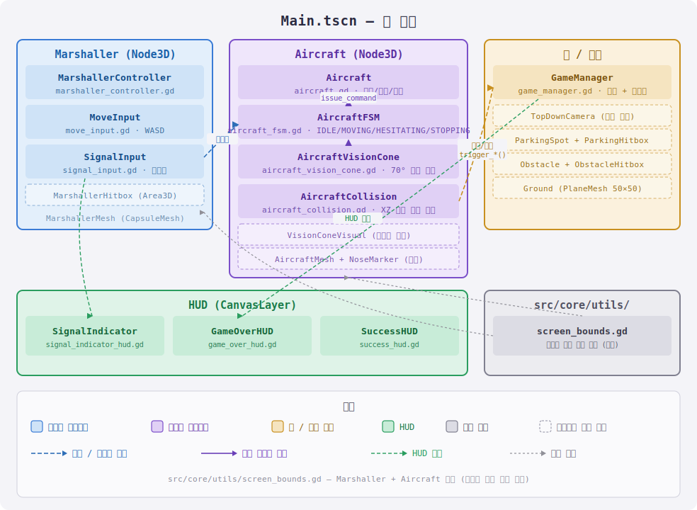

## 개요

비행기 주차를 위한 수신호 보내기 시뮬레이션 게임

### 기술 스택

Godot 4.7 / GDScript / 3D 탑다운 시뮬레이션 (카메라만 탑뷰, 노드는 3D)

### MVP

* 3D 공간, 탑다운 고정 카메라
* 마샬러 직접 이동
  * 맵 위 자유 이동, 화면 경계 클램프
* 비행기 70도 시야 원뿔 + 시야 안 판정
  * 비행기 정면 기준 좌우 35도, 원뿔 밖 신호는 무시
  * 비행기가 움직이면 시야도 함께 이동 -> 플레이어가 따라다니며 위치 조정
* 수신호 입력 (전진/정지/좌우회전), 시야 안에서만 인식, hold-to-move
  * 마샬러 이동(WASD)과 수신호(방향키)를 분리 — ↑전진, ←좌회전, →우회전, ↓정지, 모두 누르고 있는 동안만 유지
  * 무신호(NONE)와 정지(STOP)는 의미가 다름 — 실제 마샬링도 "신호 없음"과 "정지 명령"을 구분
    (지금은 둘 다 비행기를 멈추지만, AircraftFSM에서 무신호는 모호함/멈칫으로 다르게 처리할 예정)
* 비행기 FSM (딜레이+관성으로 신호 해석, 즉각 반응 금지)
  * IDLE -> INTERPRETING -> MOVING -> STOPPING
  * 모호한 신호는 멈칫 또는 오해 가능
* 충돌 -> 게임 오버
  * 비행기-장애물 충돌
  * 사람(마샬러)-비행기 충돌
* A->B 유도 성공/실패 판정

## 설계
### 폴더 구조

```text
project.godot
assets/                     아트, 사운드, 폰트 등 게임 에셋
src/
  core/
    main_game/              메인 씬 + 게임 진행 관리 (Main.tscn, game_manager.gd)
    utils/                  여러 노드가 공유하는 재사용 스크립트 (screen_bounds.gd)
  gameplay/
    aircraft/               비행기 로직 (이동/FSM/시야/충돌)
    marshaller/             마샬러 로직 (이동/입력/수신호)
  ui/                       HUD (수신호 표시, 게임오버, 성공)
  debug/                    개발/디버그 도구 (시야 시각화, FPS/버전 HUD, 프로젝트 설정)
tests/                      단위 테스트 (자체 경량 하네스, 애드온 없음)
docs/                       문서, 다이어그램
```

### 테스트

외부 애드온 없이 도는 경량 자체 하네스. `tests/tests.tscn` 을 실행하면 모든 테스트를 돌리고
통과/실패를 출력한 뒤 실패 개수를 종료 코드로 반환한다 (CI 연동 가능).

```powershell
# Windows: 헬퍼 스크립트 권장 (GUI 빌드는 콘솔에 로그가 안 붙어 리다이렉트가 필요함)
./run_tests.ps1
```

```bash
# 그 외 / 직접 실행 (콘솔 빌드거나 stdout이 보이는 환경)
godot --headless --path . res://tests/tests.tscn
```

> Windows Godot 에디터 실행 파일은 GUI 프로그램이라 대화형 콘솔에 직접 실행하면 `print` 로그가 보이지 않는다.
> `run_tests.ps1` 은 `Start-Process -RedirectStandardOutput` 으로 stdout을 받아 다시 출력한다.

- `screen_bounds` — 카메라 가시 영역 계산 (순수 함수)
- `aircraft_vision_cone` — 시야 원뿔 각도/반경 판정 (상태 없는 기하)
- `aircraft_fsm` — 신호 해석 상태 전이 (페이크 비행기/시야/수신호로 구동)

### 씬 계층 구조

```text
MainGame (Node)                  앱 루트. Process Mode = Always
├─ Systems                       상위 시스템 (초기화/전환/게임 진행)
│  └─ GameManager                판정 + 재시작  [group: game_manager]
├─ World (Node3D)                게임 세계. Process Mode = Pausable
│  ├─ TopDownCamera              직교 탑다운 카메라
│  ├─ LevelRoot                  배경 요소
│  │  ├─ Ground
│  │  ├─ Obstacle                [group: obstacle]
│  │  └─ ParkingSpot             [group: parking]
│  ├─ EntityRoot                 핵심 요소
│  │  ├─ Marshaller              [group: marshaller]
│  │  │  ├─ MoveInput / SignalInput [group: signal_input]
│  │  │  └─ MarshallerMesh
│  │  └─ Aircraft
│  │     ├─ AircraftMesh / NoseMarker
│  │     ├─ VisionCone / VisionConeVisual
│  │     ├─ AircraftFSM
│  │     └─ AircraftHitbox
│  └─ EffectRoot                 임시 시각 효과 (향후)
├─ HudLayer (layer 10, Pausable) └─ HudRoot
│     ├─ SignalIndicator
│     ├─ GameOverHUD             [group: game_over_hud]
│     └─ SuccessHUD              [group: success_hud]
├─ PauseLayer (layer 20, Always)      └─ PauseRoot        (향후)
├─ TransitionLayer (layer 100, Always) └─ TransitionRoot  (향후)
└─ DebugLayer (layer 128, Always)     └─ DebugRoot        (향후)
```

- 각 `*Root` Control 은 `mouse_filter = Ignore`.
- 노드 간 참조는 계층 경로가 아니라 **그룹**으로 찾아 트리 위치에 독립적이다 (`get_tree().get_first_node_in_group(...)`).

### 주요 구성



**마샬러**
- `MarshallerController` — 이동만 담당 (WASD)
- `MoveInput` — 이동 입력 전담
- `SignalInput` — 수신호 입력 전담. 방향키 -> 신호 타입(전진/정지/좌우회전) 변환만, 판정은 안 함.
  모두 hold-to-move. 키를 떼면 NONE(무신호) — NONE과 STOP은 별개 값
- `ScreenClamp` — (공용 컴포넌트) 부모를 화면 경계 안으로 클램프. 마샬러/비행기가 공유

**비행기**
- `Aircraft` — 위치/속도/회전, 딜레이+관성 이동 로직
- `AircraftVisionCone` — 정면 기준 70도 원뿔 판정, 마샬러가 원뿔 안에 있는지 bool만 반환
- `AircraftFSM` — IDLE/MOVING/HESITATING/STOPPING 전이. 신호 + 시야 판정을 함께 받아 Aircraft에 명령 전달. 무신호는 멈칫 후 정지, STOP은 즉시 정지
- `AircraftCollision` — XZ 거리 기반으로 마샬러/장애물/주차지점 근접 판정 -> GameManager 통지

**UI**
- `SignalIndicatorHUD` — 마샬러가 현재 입력 중인 수신호를 화면에 아이콘으로 표시 (텍스처 없이 코드로 그림)

**공유/판정**
- `Obstacle` / `ParkingSpot` — 그룹(obstacle/parking)만 붙은 위치 마커. AircraftCollision이 거리로 판정
- `GameManager` — 게임오버(비행기-장애물/사람) / A->B 도착 성공 처리 + 재시작
- `ScreenBounds` / `ScreenClamp` / `SceneQuery` — 공용 유틸 (경계 계산 / 경계 클램프 / 그룹 단일 조회)

### 로드맵

- [x] 프로젝트 토대
  - [x] 폴더 구조 확정 (scenes/, scripts/, assets/)
  - [x] 노드 이름 규칙 확정 (설계 섹션 명명 그대로: Marshaller, Aircraft, GameManager 등)
  - [x] Godot 프로젝트 생성 (Main.tscn에 TopDownCamera/Marshaller/Aircraft/GameManager 뼈대)
- [x] 마샬러(플레이어) 직접 이동
  - [x] 맵 위 자유 이동 (WASD — 방향키는 수신호 입력으로 분리됨)
  - [x] 화면 경계 클램프 (탑다운 카메라 orthogonal size + 화면 비율 기준 실측 계산)
- [x] 비행기 70도 시야 원뿔 + 시야 안 판정
  - [x] AircraftVisionCone: 정면 기준 좌우 35도 + 반경 판정, bool만 반환
  - [x] 디버그 시각화로 확인 (부채꼴 초록/빨강)
- [x] 비행기 기본 이동 + 딜레이/관성
  - [x] Aircraft: 명령 수신 후 딜레이(command_delay) 후 반영, 가속/감속으로 점진적 속도 변화
  - [x] 화면 경계 클램프 (Marshaller와 동일한 ScreenBounds 유틸리티 공유)
  - [x] 임시 디버그 자동조종으로 확인 — 이후 실제 수신호 입력 시스템으로 대체됨
- [x] 수신호 입력 시스템 (전진/정지/좌우회전), 시야 안에서만 인식
  - [x] SignalInput: 방향키 hold-to-move (↑전진/←좌회전/→우회전/↓정지), 마샬러 이동(WASD)과 분리
  - [x] NONE(무신호)과 STOP(정지)을 별개 값으로 유지 (AircraftFSM에서 다르게 다룰 수 있도록)
  - [x] AircraftSignalReceiver(임시): 시야 판정 + SignalInput 조합 -> Aircraft 명령. 시야 밖/무신호/정지는 모두 정지
  - [x] SignalIndicatorHUD: 현재 신호를 화면 아이콘으로 표시
  - [x] 회전 속도 50→25°/s로 조정
- [x] 비행기 FSM (신호 해석/오해/멈칫)
  - [x] AircraftFSM: IDLE/MOVING/HESITATING/STOPPING 전이
  - [x] NONE(무신호): 이동 중 1초 멈칫 후 정지 (재지시 오면 MOVING 복귀)
  - [x] STOP(명확한 정지): 즉시 정지 시작, 멈칫 없음
  - [x] 시야 밖: 유도자를 놓친 것이므로 즉시 정지 (무신호 멈칫보다 엄격)
- [x] 충돌 -> 게임 오버 (비행기-장애물, 사람-비행기)
  - [x] AircraftCollision: 비행기가 XZ 거리로 근접 판정 (Area3D 시그널 대신)
  - [x] 마샬러/장애물을 그룹(marshaller/obstacle)으로 조회 → 접촉 시 게임 오버
  - [x] GameManager: 게임 오버 처리, 재시작 (엔터/ESC)
  - [x] GameOverHUD: 전체화면 오버레이 표시
- [x] A->B 유도 목표 및 성공/실패 판정
  - [x] ParkingSpot: 목표 주차 지점 (초록 박스, parking 그룹)
  - [x] 비행기가 ParkingSpot 근접 거리 안에 들어오면 → 유도 성공
  - [x] SuccessHUD: 초록 오버레이 + "유도 성공!" 텍스트
  - [x] 성공/실패 모두 엔터 / ESC 로 재시작

## 관리 문서

- README.md 개요
- [docs/CODE_GUIDE.md](docs/CODE_GUIDE.md) 코드 읽기 가이드 (처음 읽는 순서 + 핵심 패턴)
- DEVLOG.md 진행 로그
- MEMORY.md 회고
