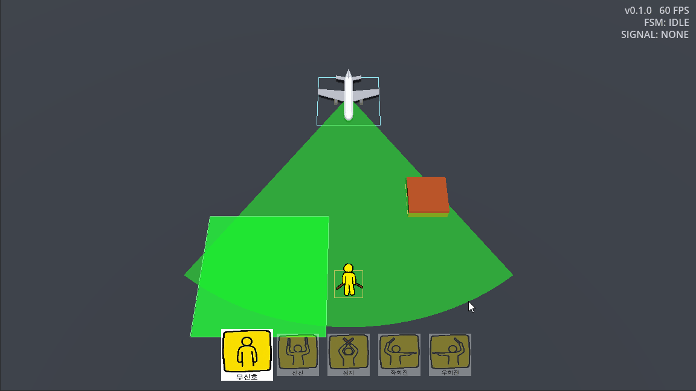

# 공항 마샬링 게임

비행기 주차를 위한 수신호 보내기 시뮬레이션 게임.
 
Godot 4.7 · GDScript · 3D Top-down

## 프로젝트 목표

작은 게임을 반복해서 완성하는 연습의 일환으로 만든 프로토타입입니다.

## 현재 구현

- 마샬러 직접 이동
- 비행기 시야 안에서만 수신호 인식
- 관성을 가진 비행기 FSM
- 장애물/사람 충돌 시 게임 오버
- 주차 완료 후 엔진 정지로 성공 판정

## 조작

| 키 | 동작 |
|---|---|
| `W` `A` `S` `D` | 마샬러 이동 (상 / 하 / 좌 / 우) |
| `↑` `←` `→` `↓` | 수신호 (전진 / 좌회전 / 우회전 / 정지) |
| `Space` | 주차 후 엔진정지 확정 |
| `Enter` · `ESC` | 재시작 |

## 문서

- [docs/DEVLOG.md](docs/DEVLOG.md) - 진행 로그 · 히스토리
- [docs/MEMORY.md](docs/MEMORY.md) - 개발 회고
- [docs/ROADMAP.md](docs/ROADMAP.md) - 완료/예정 항목
- [docs/CODE_GUIDE.md](docs/CODE_GUIDE.md) - 코드 읽는 순서 · 핵심 패턴
- [docs/ARCHITECTURE.md](docs/ARCHITECTURE.md) - 폴더 구조 · 씬 계층 · 컴포넌트
- [docs/TESTING.md](docs/TESTING.md) - 테스트 하네스 · 실행 방법