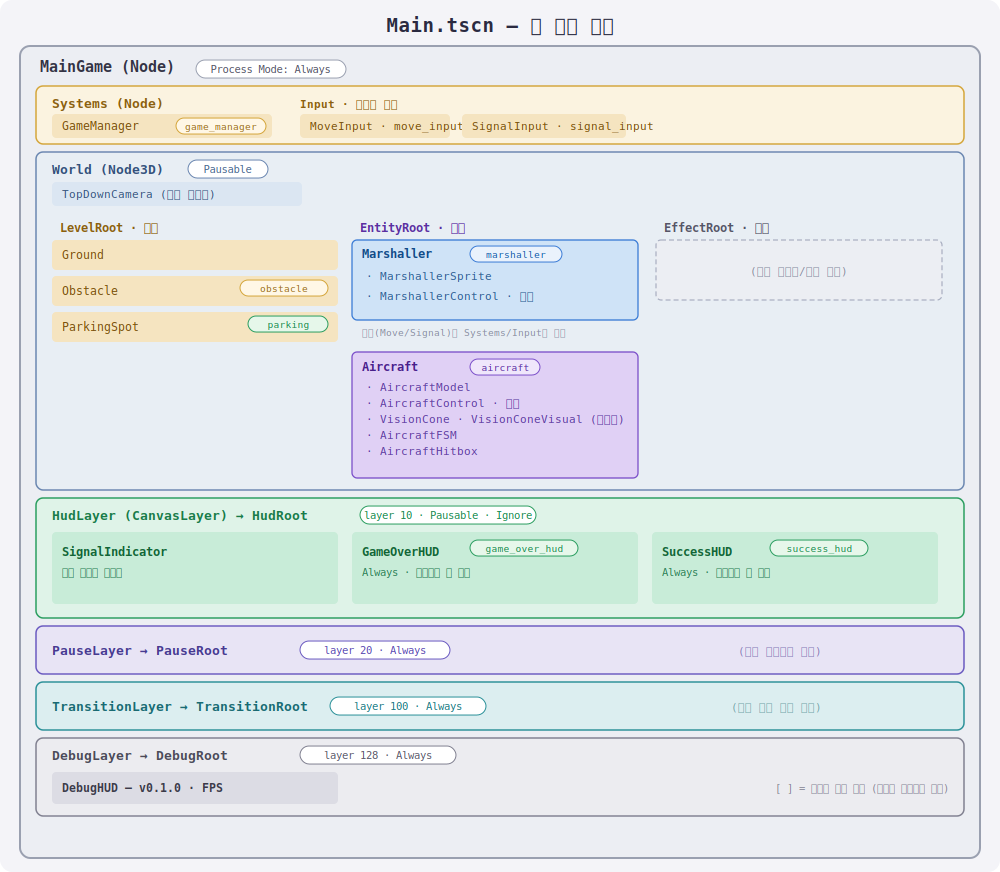

# 아키텍처

프로젝트 구조와 주요 컴포넌트를 설명하는 문서입니다.

코드를 읽는 순서는 [CODE_GUIDE.md](CODE_GUIDE.md) 참고.

## 폴더 구조

```text
project.godot
assets/                     아트, 사운드, 폰트 등 게임 에셋
src/
  core/
    main_game/              메인 씬 + 게임 진행 관리 (Main.tscn, game_manager.gd)
    utils/                  여러 노드가 공유하는 재사용 스크립트 (scene_query.gd, collision_2d.gd 등)
  gameplay/
    input/                  입력 전담 (이동키/수신호 → 값 변환, 특정 엔티티 비의존)
    aircraft/               비행기 로직 (설정·명령/이동/FSM/시야/충돌)
    marshaller/             마샬러 로직 (설정/이동/스프라이트)
  ui/                       HUD (수신호 표시, 게임오버, 성공)
  debug/                    개발/디버그 도구 (시야 시각화, FPS/버전 HUD, 프로젝트 설정)
tests/                      단위 테스트 (자체 경량 하네스, 애드온 없음)
docs/                       문서, 다이어그램
```

## 씬 계층 구조



```text
MainGame (Node)                  앱 루트. Process Mode = Always
├─ Systems                       상위 시스템 (초기화/전환/게임 진행)
│  └─ GameManager                판정 + 재시작  [group: game_manager]
├─ World (Node3D)                게임 세계. Process Mode = Pausable
│  ├─ TopDownCamera              직교 탑다운 카메라
│  ├─ LevelRoot                  배경 요소
│  │  ├─ Ground
│  │  ├─ Obstacle                [group: obstacle]
│  │  └─ ParkingSpot             [group: parking]
│  ├─ EntityRoot                 핵심 요소
│  │  ├─ Marshaller              [group: marshaller]
│  │  │  ├─ MarshallerSprite
│  │  │  ├─ MoveInput / SignalInput [group: signal_input]
│  │  │  └─ MarshallerControl     이동 실행
│  │  └─ Aircraft                [group: aircraft]
│  │     ├─ AircraftModel
│  │     ├─ AircraftControl       이동 실행
│  │     ├─ VisionCone / VisionConeVisual
│  │     ├─ AircraftFSM           [group: aircraft_fsm]
│  │     └─ AircraftHitbox
│  └─ EffectRoot                 임시 시각 효과 (향후)
├─ HudLayer (layer 10, Pausable) └─ HudRoot
│     ├─ SignalIndicator
│     ├─ GameOverHUD             [group: game_over_hud]
│     └─ SuccessHUD              [group: success_hud]
├─ PauseLayer (layer 20, Always)      └─ PauseRoot        (향후)
├─ TransitionLayer (layer 100, Always) └─ TransitionRoot  (향후)
└─ DebugLayer (layer 128, Always)     └─ DebugRoot        (향후)
```

- 각 `*Root` Control 은 `mouse_filter = Ignore`.
- 노드 간 참조는 계층 경로가 아니라 **그룹**으로 찾아 트리 위치에 독립적이다 (`get_tree().get_first_node_in_group(...)`).

## 주요 구성

**마샬러**
- `Marshaller` — 설정(speed)·정체성 루트. 이동/입력/스프라이트 컴포넌트를 붙인다
- `MarshallerControl` — 이동 실행 (MoveInput 방향 × speed로 부모 이동)

**입력** (`gameplay/input/`, 특정 엔티티 비의존)
- `MoveInput` — 이동 입력 전담 (WASD → XZ 방향)
- `SignalInput` — 수신호 입력 전담. 방향키 -> 신호 타입(전진/정지/좌우회전) 변환만, 판정은 안 함.
  모두 hold-to-move. 키를 떼면 NONE(무신호) — NONE과 STOP은 별개 값. 이동 신호 판별(`is_move_signal`) 제공

**비행기**
- `Aircraft` — 설정·명령 루트. 수신호를 받아 내부 명령(Command)으로 번역(`issue_signal`)하고 딜레이(반응 지연)를 해소. 이동/시야/충돌 컴포넌트를 붙인다
- `AircraftControl` — 이동 실행 (명령/설정을 읽어 속도 관성 + 회전 + 전진을 부모에 반영)
- `AircraftVisionCone` — 정면 기준 70도 원뿔 판정, 마샬러가 원뿔 안에 있는지 bool만 반환
- `AircraftFSM` — IDLE/MOVING/HESITATING/STOPPING 전이만 담당. 신호 + 시야를 받아 Aircraft에 신호 전달(`issue_signal`). 무신호는 멈칫 후 정지, STOP은 즉시 정지
- `AircraftCollision` — XZ 거리 기반으로 마샬러/장애물/주차지점 근접 판정 -> GameManager 통지

**UI**
- `SignalIndicatorHUD` — 마샬러가 현재 입력 중인 수신호를 화면에 아이콘으로 표시 (텍스처 없이 코드로 그림)

**공유/판정**
- `Obstacle` / `ParkingSpot` — 그룹(obstacle/parking)만 붙은 위치 마커. AircraftCollision이 거리로 판정
- `GameManager` — 게임오버(비행기-장애물/사람) / A->B 도착 성공 처리 + 재시작
- `SceneQuery` / `Collision2D` / `CollisionShapes` / `Countdown` — 공용 유틸 (그룹 단일 조회 `require_single` / OBB 겹침 SAT / 메쉬 AABB 반크기 / 프레임 카운트다운). `ScreenBounds`는 현재 테스트에서만 사용

## 더 볼 것

- 테스트 하네스와 실행 방법 → [TESTING.md](TESTING.md)
